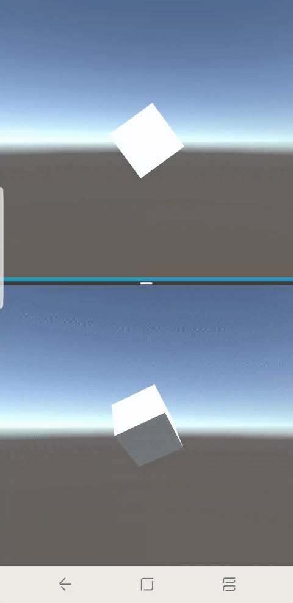

# Unity-SupportMultiWindow
Supports app pause controll in split window/pop-up window of Android for Unity engine.

안드로이드에서 멀티윈도우 사용시 앱이 멈추지 않는 기능을 지원한다.


# 개발 이유
멀티테스킹이 되게 해달라는 퍼블리셔의 요청.
안드로이드 7 이전에는 스플릿 윈도우를 사용하더라도 앱이 멈추지 않았는데 7 이후에는 모든 기종에서 onPause가 호출되는것으로 보인다.

Multi-Resume는 안드로이드 Q의 피쳐이기때문에 이용 불가
@see https://android-developers.googleblog.com/2018/11/get-your-app-ready-for-foldable-phones.html

그래서 멀티윈도우 상태면 게임이 멈추지 않는 기능을 추가했다.

# 테스트 환경
Unity 5.6.6 f2

* 삼성 갤럭시 노트9 AOS 9.0
* 삼성 갤럭시 S9+ AOS 8.0
* LG G4 AOS 7.0

root에 있는 샘플앱으로 테스트가 가능하다.

# 주의
*유니티가 해당기능에 compatible하게 개발되어있지 않기 때문에 문제가 있을 수 있다.*

액티비티의 라이프 사이클 깨짐에 대한 우려가 있다. (특히 배터리)

기존에 적용중인 라이브러리들에 대한 QA가 필요하다.

그래서 우리도 개발하고도 적용하지 않기로 했다.

# 사용 방법
## 직접 사용
### 설치
[com.deb.SupportMultiWindow.jar](Assets/Plugins/Android/com.deb.SupportMultiWindow.jar)를 사용할 프로젝트의 Plugins/Android 하위에 복사한다.
### 사용
AndroidManifest에서 main activity를 "com.deb.supportmultiwindow.UnityPlayerActivity"로 지정한다
[AndroidManifest](Assets/Plugins/AndroidManifest.xml) 참조

````
<application>
    <!--Support Multi Window UnityPlayerActivity-->
	  <activity android:name="com.deb.supportmultiwindow.UnityPlayerActivity">
      <intent-filter>
        <action android:name="android.intent.action.MAIN" />
        <category android:name="android.intent.category.LAUNCHER" />
        <category android:name="android.intent.category.LEANBACK_LAUNCHER" />
      </intent-filter>
      <meta-data android:name="unityplayer.UnityActivity" android:value="true" />
    </activity>
```` 
## custom activity

[UnityPlayerActivity](Unity-SupportMultiWindow/AndroidProject/SupportMultiWindowApp/src/com/deb/supportmultiwindow/UnityPlayerActivity.java) 의 onPause, OnResume 참조
````
// Pause Unity
    @Override protected void onPause()
    {
    	boolean isExcuteable = true;
    	try{
    		if (Build.VERSION.SDK_INT >= Build.VERSION_CODES.N)
    	    {
    			isExcuteable = !this.isInMultiWindowMode();
    	    }
    	}catch (Exception e){
    	     e.printStackTrace();
    	}finally{
    		super.onPause();     
    		if(isExcuteable)
    		{
    	         mUnityPlayer.pause();
    	         isAppPaused = true;
    		}
    	} 
    }

    // Resume Unity
    @Override protected void onResume()
    {
    	boolean isExcuteable = true;
    	try{
    		if (Build.VERSION.SDK_INT >= Build.VERSION_CODES.N)
    	    {
    			isExcuteable = !this.isInMultiWindowMode();
    	    }
    	}catch (Exception e){
    	     e.printStackTrace();
    		
    	}finally{
    		super.onResume();
    		if(isAppPaused || isExcuteable)
    		{
    	    	 mUnityPlayer.resume();
    		}
    		isAppPaused = false;
    	} 
    }
````
